# The Thresher
## v1.1.0 - Testing Changes - Round 1

### First Testing Reflection, v1.1.0

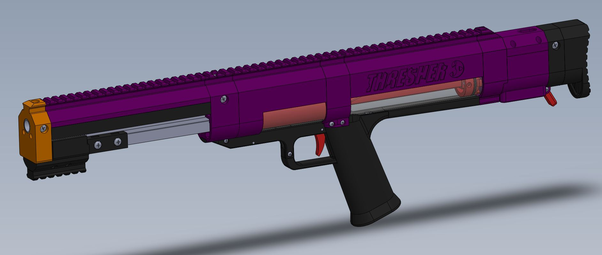

After the initial prototyping the blaster was pretty usable. There was some reloading issues but pumping a bit slower usually worked. In order to eliminate the slow reload and make the action more reliable I partially redesigned the pusher and added a dart guide to the top of the magwell. This redesign also added a little bit to the length of the blaster that only modified the butt plate, thus preventing any hardware changes.

There was also an issue with the pump action mashing the users hands on both the forward and backward stroke. I initially didn't want to add much distance between the pump grip and the linear rail carriage for fear of loosing the smooth pump by adding some possible rotational force. In practice however, it feels just as good with the spacer as it did without. Adding the spacer also allowed me to increase the size of the pump picatinny. Now it fits more grip styles outside of the basic Worker pump grip and the rail is attached more securely to the carriage.

After shooting a ton of darts I also noticed there was a gap forming between the tube spacer and the turnaround. In order to prevent a possible failure I extended the top support bar and picatinny rail onto the turnaround. This did increase the hardware cost slightly but I feel that the reinforcement of the design was more important.

I also designed the cover spacer for the under tube support bar. Gotta keep up the *\~=A E S T H E T I C S=\~*.

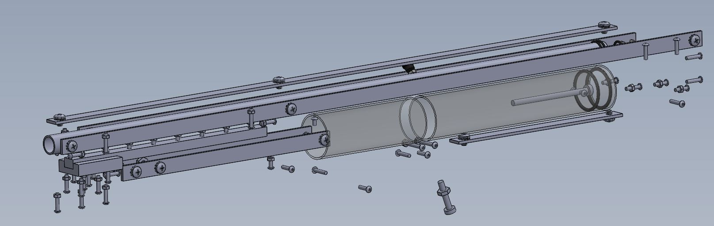

There is a huge cost problem with this design. The total parts cost, excluding 3D printed parts, is $45 US a blaster. This number is determined from McMaster piece cost so it is rather inflated but the issue does stand; this is not a cheap project to make. I want to take a bit and redesign the core structure of the blaster to try to eliminate both hardware as well as attempt to decrease the total number of printed parts. A more monolithic design would be easier to assemble, more simple to print, and easier to source parts for. As it stands this blaster has 13 different sizes of screws and 29 printed parts. My goal for a redesign is to cut both of those *at least* in half. This won't decrease cost that much but it will make it slightly more palatable...

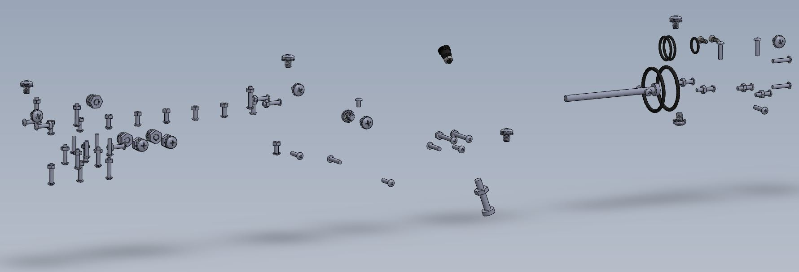

I also want to redesign some of the parts around the spring to allow for easier spring swaps. As it is right now it is rather hard to swap springs. My personal goal would be to make it about as easy as the Harrier. Not necessarily field swappable, but doable.

### Prototype Reflection and Future Plans, v1.0.5

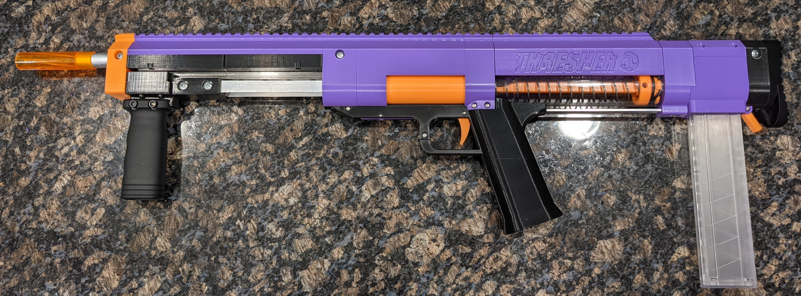

The first prototype is complete! There were a few issues during development but nothing serious enough to make me think there were fundemental problems with the design. The biggest problem I faced was the slot in the pump bar. I had underestimated how hard it would be to create a centered and even slot in an aluminum bar with the tools that I have on hand. I am currently thinking of other ways I could implement the slot or possibly other tools that would make it easier. I ended up ordering a few pump bars from an online metal fabrication business. The cost was relatively close to the raw part cost from McMaster. I may just use this service into the future if I end up selling kits for this blaster.

Aside from a few clearance and fit changes, there was only two real redesigns during the first prototyping phase. With some input from my brother I changed the geometry of the Trigger Link and Catch to allow for the blaster to actually fire. The intial design theoretically worked but in practice it the Trigger Link applied more of a up and backward force instead of just pushing the catch straight up. This made the force to overcome the catch quite significant which resulted in the Trigger Link bending instead of actuating the catch. The new design is way more reliable and it feels a lot better to pull the actual trigger. The new design also required the Trigger Link to rotate a bit farther so the Trigger Guard Core needed some structural changes to allow for this.

The other major design change was the addition of a new support bar underneath the plunger tube between the Grip and the Turnaround. I noticed that there was a bit of deflection in the back portion of the blaster after firing it a few times. The new bar does add some material cost to the design but I feel that it is rather necessary for the overall structural rigidity of the back half of the blaster. I will be adding a spacer to cover this new bar in the future. Gotta keep that *\~=A E S T H E T I C=\~* up.

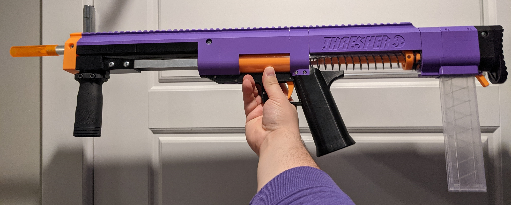

#### Future Plans

There are some other design changes that I am seriously considering in future updates. ~~The top support bar should probably extend up to the Turnaround at least. This would really help keep the overall rigidity of the blaster pretty solid.~~ This was fixed in v1.1.0!

~~The Mag Release does not feel the greatest. I think this is mainly due to some clearance issues with the Butt Plate. The shape of the Mag Release was pulled from my other blaster project [The Fin](https://github.com/TunaHero/TheFin) (though I do not recommend printing that one right now... there are still some fundemental issues that need to be ironned out...). I just need to redesign the paddle portion of the mag release to give the user a bit more room to comfortably press it down.~~ The Butt Plate was pulled back to support the new Pusher design. Fixed in v1.1.0!

The Butt Plate could be bigger. It's about the same size as the butt of the Caliburn v4 but it still feels a bit small. Aesthetically it is a bit weird looking too...

#### BETA TESTING

In the near future I will be reaching out to some people to beta test this project! The material cost is rather high for some random project so I will be supplying the hardware and the testers just have to print the parts. I will update this page with the outcomes of the beta test.

### The Initial Release

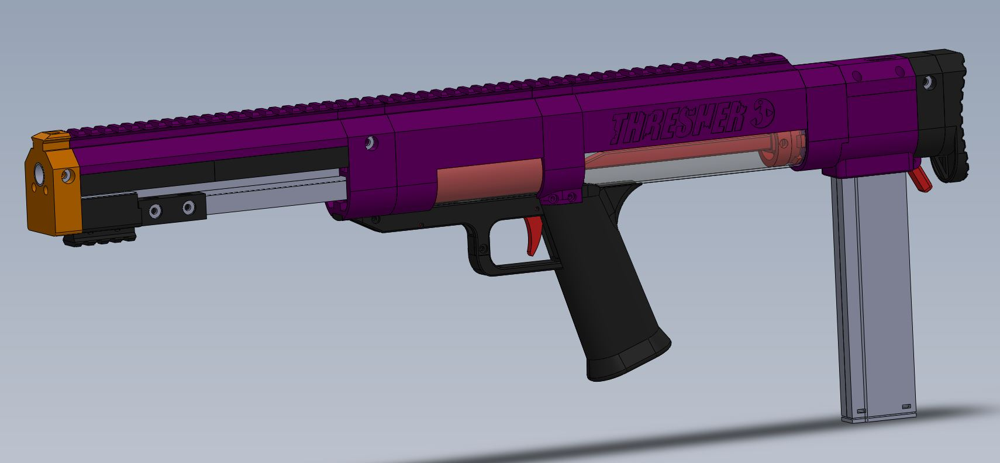

WARNING: THIS BLASTER IS EXPENSIVE AND FINICKY. PRINT AT YOUR OWN RISK.

The Thresher is a bullpup pump action springer with a caliburn air volume. This project started as a modification to the lynx... I am in love with my Worker Harrier and I wanted to put a linear bearing on the Lynx to match that smooooooooooth pull on the Harrier. One thing led to another and I ended up designing a pump around a linear rail instead. It then evolved into designing an entire blaster around the new pump… and here we are! It uses a 200mm low profile linear rail (just something I had laying around but they are rather cheap on amazon).

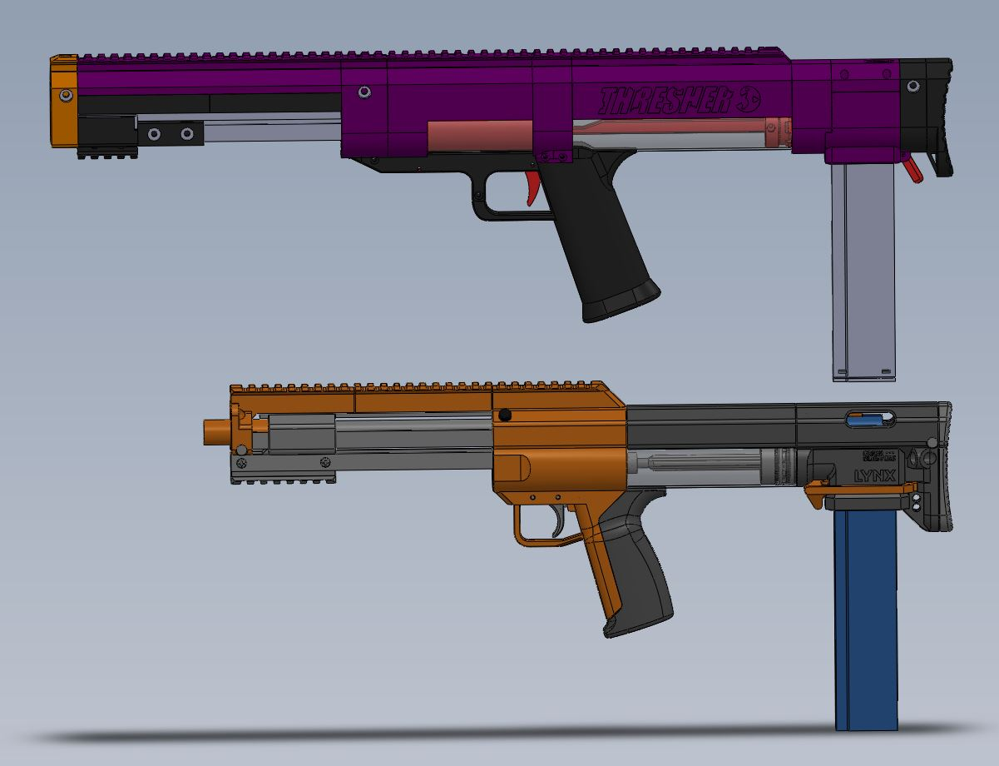

<table>
<tbody>
  <tr>
    <td width="40%"></td>
    <td>
Sort of following the nautical theme I started with my previous blaster design, this one is named after the thresher shark which is known for its rather long caudal fin i.e. the bullpup magazine hanging off the back of the blaster. Yes, the mag is hanging off the bottom and the thresher shark has a long top fin but I felt like the name fit pretty well so...
</td>
  </tr>
</tbody>
</table>

### Design Overview

<table>
<tbody>
  <tr>
    <td rowspan="2" width="20%" padding="0">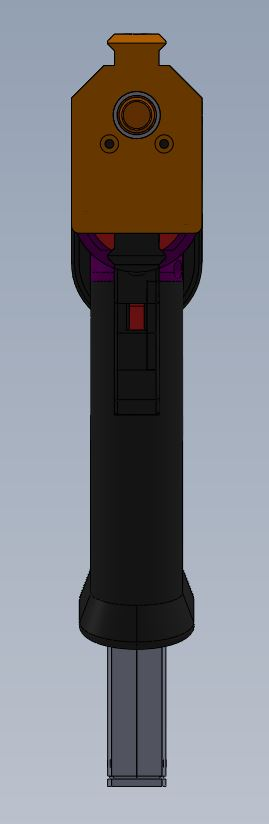</td>
    <td width="80%" padding="0">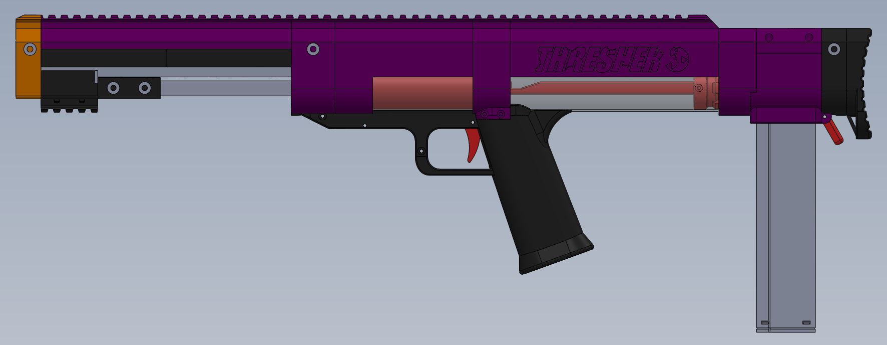</td>
  </tr>
  <tr>
    <td width="80%" padding="0">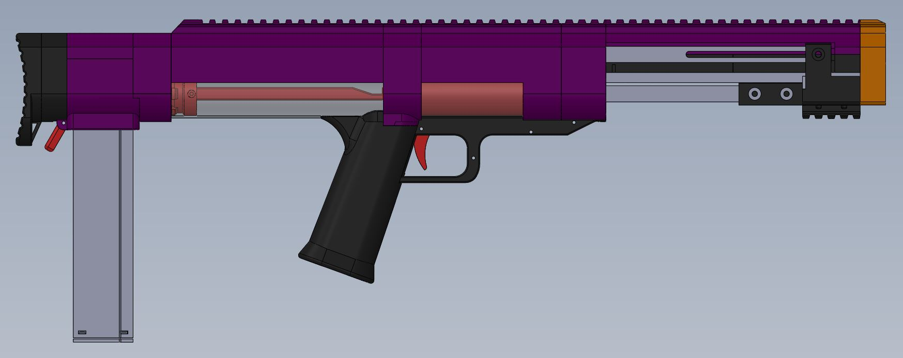</td>
  </tr>
</tbody>
</table>

The core of this blaster is designed around a 200mm linear rail. This rail theoretically should alleviate any torsional force while pulling back the pump. I wanted this smooth actuation whale also adding to the overall structural rigidity of the blaster which is why I ended up deciding to use the linear rail rather than a rod or bearings straight on aluminum bars. Now, this does add some significant cost to the overall design. The cheap rail I bought was still $15… In the future I may modify the design to use simple aluminum bars and forgo the linear rail but that is unplanned future work at the current moment.

There are 2 main structural bars that give most of the nose to butt support for the blaster. The first runs through the left side and the second runs through the top picatinny rail. They are currently rather long (26in and 22in…). If the length becomes an issue in the future I will probably cut them down and stack them much like the Caliburn v4. The blaster uses the same slotted bar design that the lynx has for converting the long pump action to a short dart reload but instead of running through the top it runs along the right side.

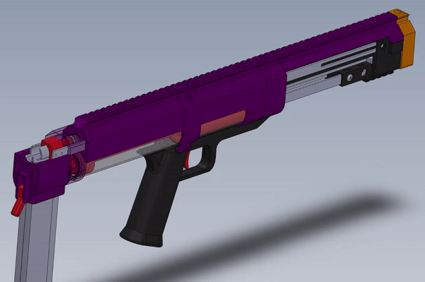

Currently this blaster uses 11in springs and a caliburn sized polycarbonate air tube. The base design compresses the 11in spring to 5.1in but this can easily be modified by changing the location of the keyway on the Plunger Shaft.

# BOM and Print Settings

Below is a link to a google sheets for the BOM (~~to be included~~ now included!!!) and print settings. ~~Print orientation to come.~~ Now included!!!

[LINK TO THE BOM AND STUFF](https://docs.google.com/spreadsheets/d/1nLO7fpEcI_VYeS-eTz37GeWA56AaHb-R7evM9M5RJZA/edit?usp=sharing)

# Print Orientation

<table>
<tbody>
  <tr>
    <td>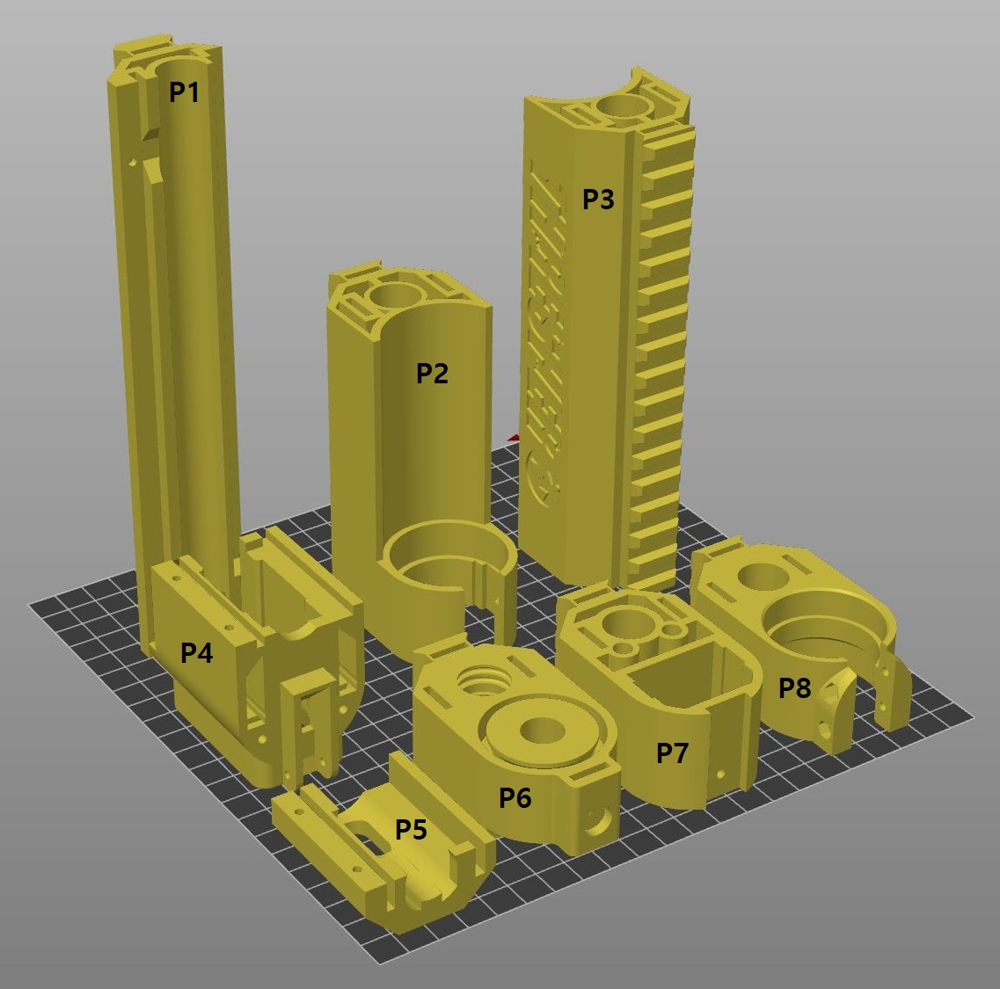</td>
    <td>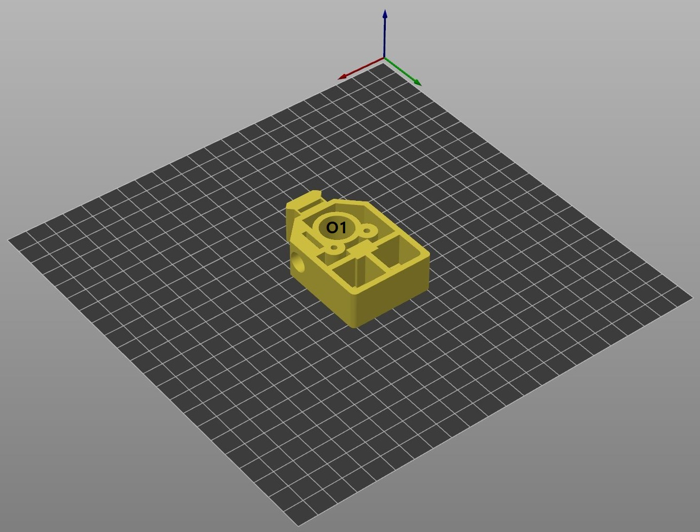</td>
  </tr>
  <tr>
    <td>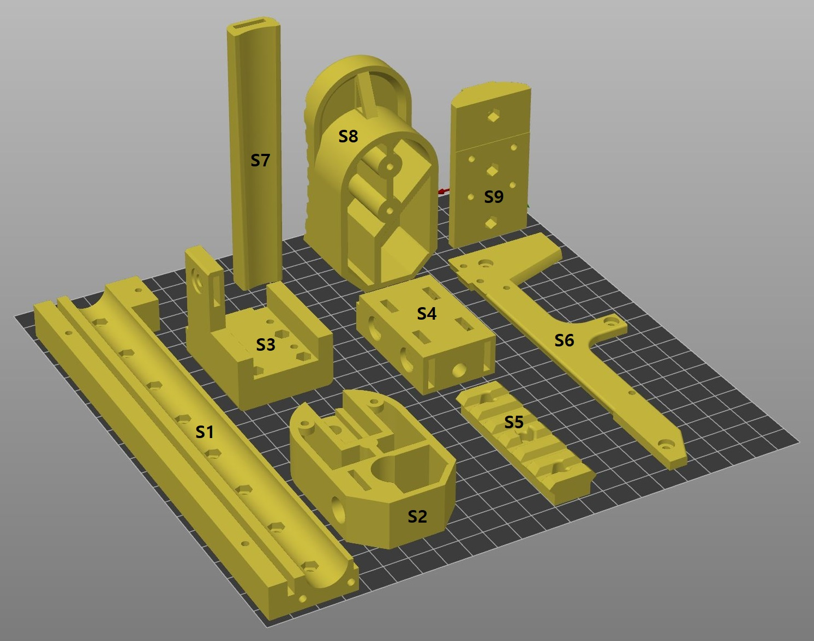</td>
    <td>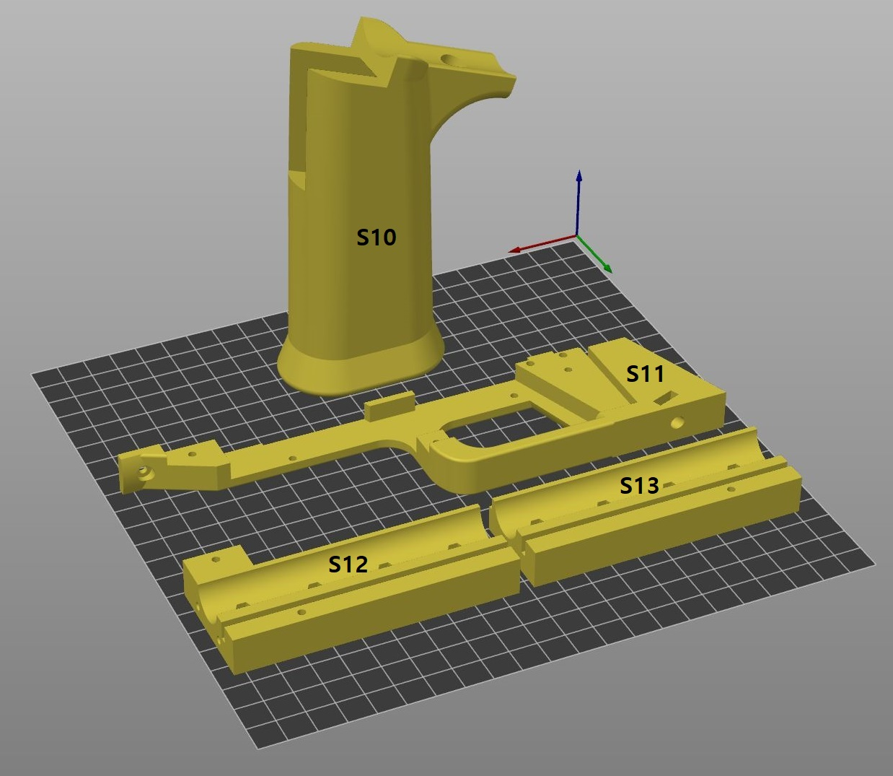</td>
  </tr>
  <tr>
    <td>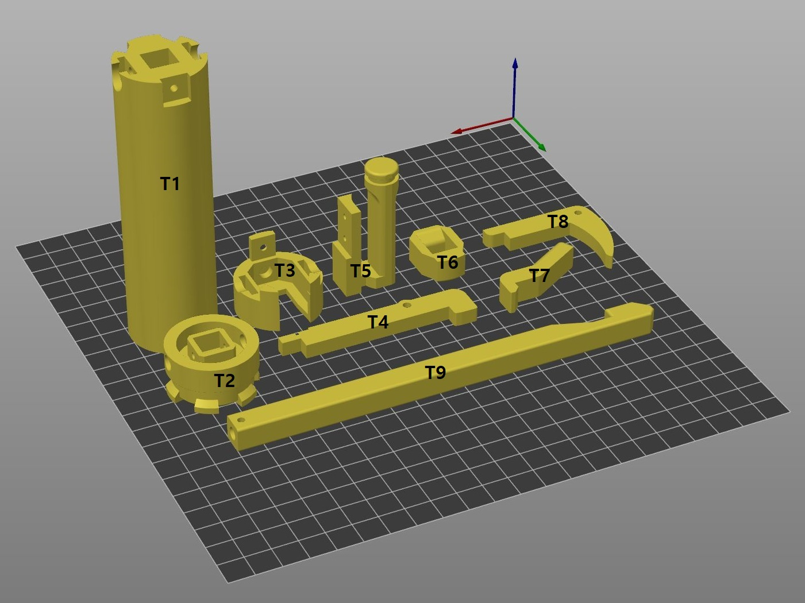</td>
  </tr>
</tbody>
</table>

<table>
<tbody>
  <tr>
    <th>Pic ID</th>
    <th>Part Name</th>
    <th>Color</th>
    <th>Infill %</th>
    <th>Supports?</th>
  </tr>
  <tr>
    <td>P1</td>
    <td>Upper Rail Support</td>
    <td>Primary</td>
    <td>20%</td>
    <td>No</td>
  </tr>
  <tr>
    <td>P2</td>
    <td>Middle Spacer</td>
    <td>Primary</td>
    <td>20%</td>
    <td>No</td>
  </tr>
  <tr>
    <td>P3</td>
    <td>Tube Spacer</td>
    <td>Primary</td>
    <td>20%</td>
    <td>No</td>
  </tr>
  <tr>
    <td>P4</td>
    <td>Magwell Bottom</td>
    <td>Primary</td>
    <td>20%</td>
    <td>No</td>
  </tr>
  <tr>
    <td>P5</td>
    <td>Magwell Top</td>
    <td>Primary</td>
    <td>20%</td>
    <td>Yes</td>
  </tr>
  <tr>
    <td>P6</td>
    <td>Turnaround</td>
    <td>Primary</td>
    <td>40%</td>
    <td>Yes</td>
  </tr>
  <tr>
    <td>P7</td>
    <td>Rail Support Back Limiter</td>
    <td>Primary</td>
    <td>20%</td>
    <td>No</td>
  </tr>
  <tr>
    <td>P8</td>
    <td>Center Block</td>
    <td>Primary</td>
    <td>20%</td>
    <td>No</td>
  </tr>
  <tr>
    <td>S1</td>
    <td>Lower Rail Support</td>
    <td>Secondary</td>
    <td>20%</td>
    <td>No</td>
  </tr>
  <tr>
    <td>S2</td>
    <td>Butt</td>
    <td>Secondary</td>
    <td>20%</td>
    <td>No</td>
  </tr>
  <tr>
    <td>S3</td>
    <td>Pump Core</td>
    <td>Secondary</td>
    <td>40%</td>
    <td>No</td>
  </tr>
  <tr>
    <td>S4</td>
    <td>Pump Core Back</td>
    <td>Secondary</td>
    <td>40%</td>
    <td>No</td>
  </tr>
  <tr>
    <td>S5</td>
    <td>Pump Picatinny</td>
    <td>Secondary</td>
    <td>40%</td>
    <td>No</td>
  </tr>
  <tr>
    <td>S6</td>
    <td>Trigger Guard Plate</td>
    <td>Secondary</td>
    <td>20%</td>
    <td>No</td>
  </tr>
  <tr>
    <td>S7</td>
    <td>Lower Tube Spacer</td>
    <td>Secondary</td>
    <td>20%</td>
    <td>No</td>
  </tr>
  <tr>
    <td>S8</td>
    <td>Butt Plate</td>
    <td>Secondary</td>
    <td>20%</td>
    <td>No</td>
  </tr>
  <tr>
    <td>S9</td>
    <td>Pump Spacer</td>
    <td>Secondary</td>
    <td>40%</td>
    <td>No</td>
  </tr>
  <tr>
    <td>S10</td>
    <td>Grip</td>
    <td>Secondary</td>
    <td>20%</td>
    <td>Yes</td>
  </tr>
  <tr>
    <td>S11</td>
    <td>Trigger Guard Core</td>
    <td>Secondary</td>
    <td>20%</td>
    <td>No</td>
  </tr>
  <tr>
    <td>T1</td>
    <td>Plunger Cup</td>
    <td>Tertiary</td>
    <td>40%</td>
    <td>No</td>
  </tr>
  <tr>
    <td>T2</td>
    <td>Plunger Cap</td>
    <td>Tertiary</td>
    <td>90%</td>
    <td>No</td>
  </tr>
  <tr>
    <td>T3</td>
    <td>Plunger Cup Cap</td>
    <td>Tertiary</td>
    <td>40%</td>
    <td>No</td>
  </tr>
  <tr>
    <td>T4</td>
    <td>Trigger Link</td>
    <td>Tertiary</td>
    <td>40%</td>
    <td>No</td>
  </tr>
  <tr>
    <td>T5</td>
    <td>Pusher</td>
    <td>Tertiary</td>
    <td>40%</td>
    <td>No</td>
  </tr>
  <tr>
    <td>T6</td>
    <td>Plunger Catch</td>
    <td>Tertiary</td>
    <td>90%</td>
    <td>No</td>
  </tr>
  <tr>
    <td>T7</td>
    <td>Mag Release</td>
    <td>Tertiary</td>
    <td>20%</td>
    <td>No</td>
  </tr>
  <tr>
    <td>T8</td>
    <td>Trigger</td>
    <td>Tertiary</td>
    <td>40%</td>
    <td>No</td>
  </tr>
  <tr>
    <td>T9</td>
    <td>Plunger Shaft</td>
    <td>Tertiary</td>
    <td>90%</td>
    <td>No</td>
  </tr>
  <tr>
    <td colspan="5">Alternative Parts</td>
  </tr>
  <tr>
    <td>S12</td>
    <td>Lower Rail Support - Front</td>
    <td>Secondary</td>
    <td>20%</td>
    <td>No</td>
  </tr>
  <tr>
    <td>S13</td>
    <td>Lower Rail Support - Back</td>
    <td>Secondary</td>
    <td>20%</td>
    <td>No</td>
  </tr>
</tbody>
</table>

# Changelog

Changes

- 05-09-2023: Testing Changes - Round 1 (v1.1.0)
	1. Updated Parts
		- **Center Block**
			- Added chamfer to make it easier to set plunger tubes
		- **Magwell Top**
			- Added dart guide (lead to major pusher redesign)
		- **Tube Spacer**
			- Updated end point for Top Support Bar to end in the Turnaround instead of Tube Spacer
		- **Turnaround**
			- Added a bit of Picatinny rail
			- Updated end point for Top Support Bar to end in the Turnaround instead of Tube Spacer
		- **Butt Plate**
			- Extended core structure for new pusher design
		- **Butt**
			- Made clearance for pusher
		- **Pump Core**
			- Updated screw holes for new part Pump Spacer
		- **Pump Picatinny**
			- Redesign for more picatinny and interface with Pump Spacer
		- **Trigger Guard Core**
			- Added chamfer to make it easier to set plunger tubes
		- **Trigger Guard Plate**
			- Added chamfer to make it easier to set plunger tubes
		- **Pusher**
			- Redesign to allow for dart guide
			- Now snub nosed, there were some issues with the other pusher design interfering with the darts in the magazine preventing them from being loaded into the chamber
		- **Trigger**
			- Updated structure to prevent flexing
	2. New Parts
		- **Lower Tube Spacer**
			- Cosmetic part to cover new Lower Tube Support
		- **Pump Spacer**
			- New part to prevent hand smashing on reload
				- This moves the pump picatinny lower, thus getting out of the way of the Nose and Center Block/Tigger Guard
				- Picatinny now more secure
				- 4 screws attach this part to the Pump Core with captive nuts in the Pump Core
	3. Other Changes
		- Added BOM
		- Added Print orientations
			- This includes .3mf files! They are separated into the print color
			- MASSIVE table with pics
				- Pics have part IDs, check the table for part names, infill %, and if the part needs printing supports!
		- Updated .step file to v1.1.0
		- Changed update order in ReadMe, now in descending order
- 04-25-2023: Prototype Phase 1 Complete (v1.0.5)
	1. Updated Parts
		- **Center Block**
			- Change captive nut slots into holes to prevent stripping
				- This reverted the previous changes to the slots
		- **Turn Around**
			- Updated barrel o-ring structure. It *should* work now...
			- Updated Pusher seal
			- Fixed a slicing/supports issue on back face. Now supports won't be generated in the nut holes
			- Added new support bar hardware to give some more structure on the back end of the plunger
		- **Nose**
			- Added the barrel clearance that is present everywhere else in the blaster... I just missed this one...
		- **Trigger Guard Core**
			- Changed some geometry to allow for more trigger and trigger link movement
		- **Trigger Link**
			- Updated pokie shape to interact with the catch better
			- Made the part thicker and taller to give some more structural rigidity
				- Original design bent under the force required to move the catch
		- **Plunger Catch**
			- Removed chamfered front edge to give more surface area for the trigger link to press on
				- Now the force from the link should be more directly upward meaning its easier to pull the trigger
	2. Other Changes
		- Updated the *Full Assembly v1* step file to reflect all of the part changes
		- Added "Prototype Reflection and Future Plans"
- 04-18-2023: Prototyping Update 3 (v1.0.4)
	1. Updated Parts
		- **Center Block**
			- Added clearance for locking nuts between Center Block and grip
			- Added some clearance for plunger tube
			- Changed the plunger tube support structure so that it doesn't require supports anymore
			- Fixed the barrel locking nylon screw position
		- **Nose**
			- Fixed some part thickness that resulted in bad slicing
- 04-17-2023: Prototyping Update 2 (v1.0.3)
	1. Updated Parts
		- **Turnaround**
			- Fixed barrel o-ring support structure
			- Fixed o-ring structure for plunger tube
			- Added clearance for locking nuts between Turnaround and lower magwell
	2. Other Changes
		- Added gif of the reload action
- 04-17-2023: Prototyping Update 1 (v1.0.2)
	1. Updated Parts
		- **Magwell Bottom**
			- Added clearance for mag. It was quite tight.
		- **Rail Support Back Limiter**
			- Added cut-out for pump bar screws
		- **Butt Plate**
			- Partial redesign to be printable.
			- Removed a few fillets to make the file size small enough to include directly
	2. Removed Parts/Files
		- **Butt Plate.md**
			- The part is now small enough to not need a google drive link for the .stl
	3. Other changes
		- Added google sheets page for BOM and print settings
- 04-14-2023: Fixing a few parts after initial printing (v1.0.1)
- 04-13-2023: Initial Release (v1.0)

<!-- BOM -->

<!-- Assembly Video -->

<!-- Q&A -->
